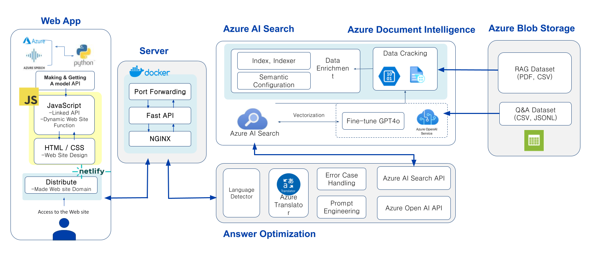
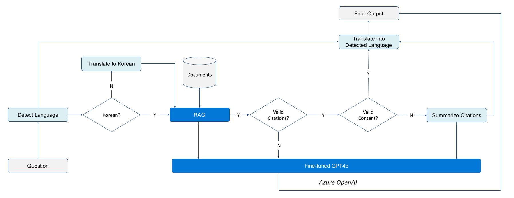

# LawBot: A legal assistant powered by RAG and a fine-tuned LLM 

LawBot is an advanced AI-powered legal assistant specializing in Korean law, designed to handle complex legal queries efficiently and accurately. It combines Retrieval-Augmented Generation (RAG) with a fine-tuned GPT-4o model to deliver precise, context-aware, and trustworthy legal information. By leveraging Azure AI services, LawBot seamlessly integrates natural language understanding, document intelligence, and advanced legal response generation.

## Key Features

- **Retrieval-Augmented Generation (RAG)**:
  - Integrates Azure AI Search to retrieve relevant legal documents from indexed datasets, including immigration and keyword-specific legal texts. Documents are from a wide range of indexed formats, including PDFs, CSVs, and JSONL files, ensuring comprehensive legal analysis.
  - Combines retrieved content with LLM capabilities to ensure responses are backed by valid citations and references.

- **Fine-Tuned LLMs**:
  - Utilizes Azure OpenAI Service with a fine-tuned GPT-4o model for contextually accurate, multilingual responses.
  - Includes techniques like Reinforcement Learning with Human Feedback (RLHF) to optimize responses for legal domain requirements.

- **Multilingual Support**:
  - Detects the user’s input language dynamically and translates queries or responses when necessary using Azure Translator and Google Translator.

- **Dynamic Validation**:
  - Validates retrieved citations for accuracy, relevance, and completeness before generating a response.
  - Falls back to GPT-based general legal knowledge if sufficient citations are not available.

- **Interactive Query Processing**:
  - Handles legal questions in domains such as immigration law and general keyword-based searches with tailored responses.
  - Provides summarized legal information derived from document analysis.

## How It Works

1. **Input Language Detection**: Automatically identifies the input language using an advanced language detector.
2. **Translation**: Converts non-Korean queries to Korean if required, ensuring compatibility with available legal data.
3. **RAG-Based Document Retrieval**: Fetches relevant legal documents using Azure AI Search’s semantic configuration.
4. **Citation Validation**: Checks citations for validity and content sufficiency.
5. **Fine-Tuned LLM Summarization**: Summarizes citations or generates fallback responses using GPT-4o if citations are insufficient.
6. **Multilingual Output**: Translates final responses back to the user’s language if needed.

## Technology Stack

- **Azure Services**: OpenAI, AI Search, Document Intelligence, and Blob Storage for end-to-end AI and data processing.
- **Natural Language Processing**: Google Translator and Azure Translator for multilingual capabilities.
- **Frameworks**: FastAPI for backend API integration, with support for scalable and cross-platform deployment.


### Project Architecture

Below is the high-level architecture of LawBot:



### Response Optimization

LawBot employs a comprehensive response optimization workflow that dynamically handles user queries and generates the most relevant answers. The workflow ensures accuracy by validating citations and content before providing the final output.



## Features

- **Backend Services**:
  - Built with FastAPI and NGINX for scalable API services.
  - Dockerized environment for easy deployment.
  - Integration with Azure AI services for document intelligence and natural language processing.

- **Frontend**:
  - Dynamic and responsive UI built with HTML, CSS, and JavaScript.
  - Interactive input forms for legal queries.
  - API-driven communication with the backend.

- **Azure AI Integration**:
  - **Azure Blob Storage**: Stores RAG datasets and Q&A datasets.
  - **Azure AI Search**: Provides semantic search and vectorization.
  - **Azure Document Intelligence**: Extracts and analyzes information from uploaded legal documents.
  - **Azure OpenAI**: Fine-tuned GPT-4 model for generating context-aware answers.

- **Response Optimization**:
  - Validates input language and translates as needed.
  - Ensures citations and content validity before summarizing and outputting answers.

## Directory Structure

```
LawBot/
├── backend/                     # Backend API and services
│   ├── docker-compose.yml       # Docker Compose file for backend
│   ├── Dockerfile               # Docker image definition
│   └── src/
│       ├── __init__.py          # Backend initialization
│       └── get_response.py      # Core API logic for generating responses
├── data/                        # Dataset for training and validation
│   ├── qna_test.csv
│   ├── qna_train.csv
│   └── qna_val.csv
├── figures/                     # Figures for documentation and visualization
│   ├── project_structure.jpeg
│   └── response_optimization.jpeg
├── frontend/                    # Frontend codebase
│   ├── index.html               # Main HTML file
│   ├── package.json             # Frontend dependencies
│   ├── script.js                # Main JavaScript logic
│   └── src/
│       ├── style.css            # Main CSS file
│       ├── word_script.js       # Word-specific JavaScript logic
│       ├── word_style.css       # Word-specific styling
│       └── word.html            # Word-specific HTML file
├── preprocess/                  # Preprocessing scripts and notebooks
│   ├── __init__.py
│   └── documentinteli.ipynb     # Notebook for document intelligence processing
├── LICENSE                      # License file
├── README.md                    # Documentation file
└── requirements.txt             # Python dependencies
```

## Installation

1. Clone the repository:
   ```bash
   git clone https://github.com/seonokkim/LawBot.git
   cd LawBot
   ```

2. Install Python dependencies:
   ```bash
   pip install -r requirements.txt
   ```

3. Build and run the backend using Docker Compose:
   ```bash
   cd backend
   docker-compose up --build
   ```

4. Serve the frontend:
   Open `frontend/index.html` in your browser.

## Usage

1. Upload legal documents or ask a query through the frontend.
2. The backend processes the input and interacts with Azure services to generate responses.
3. Final answers are displayed on the frontend with valid citations and summarized insights.

## Demo

Check a live demo of the application and further details [here](https://youtu.be/78xQtkk6AfU).

## License

This project is licensed under the MIT License. See the [LICENSE](./LICENSE) file for details.

## Acknowledgments

Special thanks to Azure AI tools and OpenAI for providing advanced APIs that power this project.
